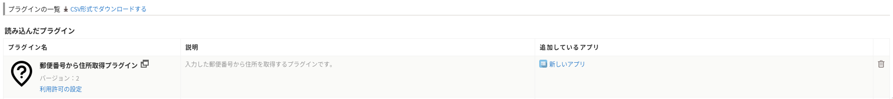
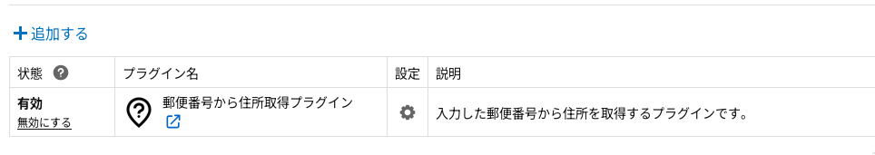
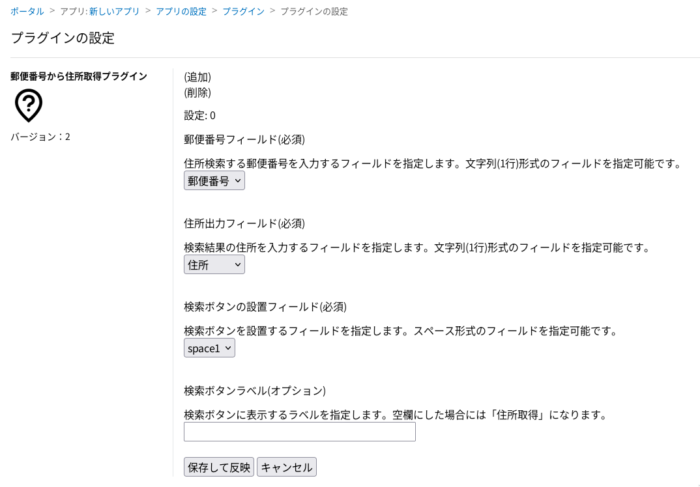
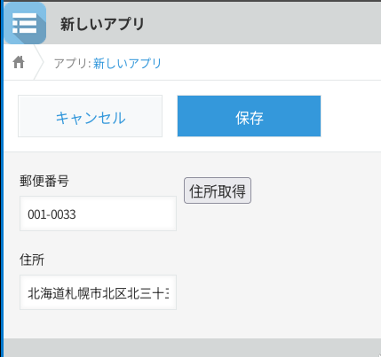

# Cybozu kintone plugin to lookup Japanese address from zip code

## Description
This kintone plugin can be used to get Japanese address string from
zip code in kintone edit screen.

The backend is zipcloud's [郵便番号検索API](https://zipcloud.ibsnet.co.jp/doc/api).
Make sure to read [郵便番号検索API利用規約](https://zipcloud.ibsnet.co.jp/rule/api).

## Dependencies
* Availability of https://zipcloud.ibsnet.co.jp/doc/api endpoint.

## Usage
You can upload a plugin.zip via a web user interface of your kintone instance. Or upload it via its API.

Click (追加) and add another set of setting.
Click (削除) and remove the set of setting.

You can use NNNNNNN instead of NNN-NNNN for ZIP code.

## Bugs
* The configuration user interface is in Japanese only.

## License
* [MIT](https://github.com/moonfilltech/kintone-zip-code-address/blob/master/LICENSE)
* The icon is from [evericons V.1.1](http://www.evericons.com/).
  It is release under [CC0 1.0 Universal (CC0 1.0)](https://creativecommons.org/publicdomain/zero/1.0/).

<!-- in Japanese -->
# 郵便番号から住所を取得するkintoneプラグイン

## このプロジェクトについての説明
kintoneアプリの編集画面で、文字列(1行) (SINGLE_LINE_TEXT)フィールドに郵便番号を入力して、文字列(1行) (SINGLE_LINE_TEXT)フィールドに住所の文字列を自動的に入力します。
取得時に押すボタンはスペースフィールドを指定して配置します。

zipcloudの[郵便番号検索API](https://zipcloud.ibsnet.co.jp/doc/api)を利用しています。
利用の際には、[郵便番号検索API利用規約](https://zipcloud.ibsnet.co.jp/rule/api)に同意してください。

## 利用している外部プロジェクト
* https://zipcloud.ibsnet.co.jp/doc/api エンドポイントが利用できる必要があります。

## 使い方
kintoneのウェブユーザーインターフェイスあるいはAPI経由で、自身のkintoneドメインにアップロードしてください。

(追加)をクリックすると、もう1セットの設定を追加できます。
(削除)をクリックすると、その設定は削除できます。

郵便番号は、NNN-NNNNでなくNNNNNNN形式でも入力可能です。

## ライセンス
* [MIT](https://github.com/moonfilltech/kintone-zip-code-address/blob/master/LICENSE)
* アイコンは[evericons V.1.1](http://www.evericons.com/)で提供されているものを利用しています。
  [CC0 1.0 Universal (CC0 1.0)](https://creativecommons.org/publicdomain/zero/1.0/)で配布されています。
